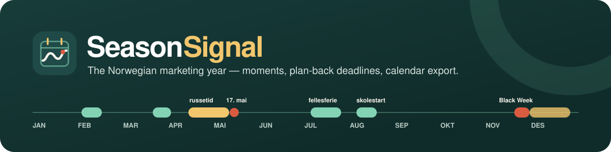
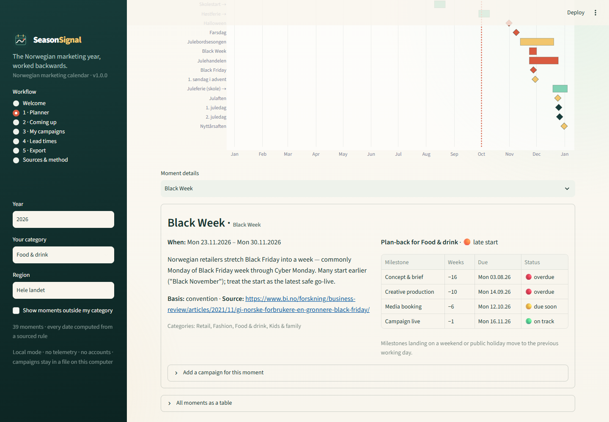
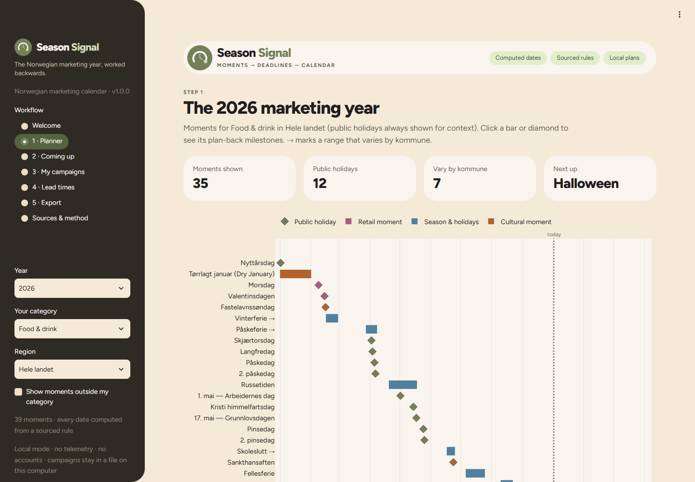
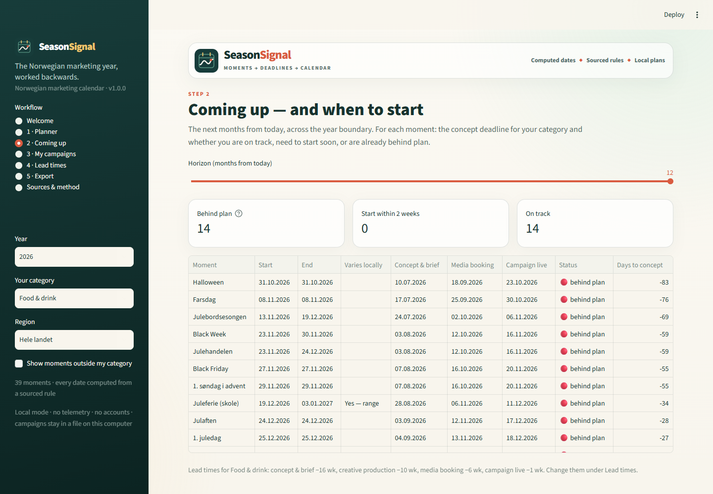
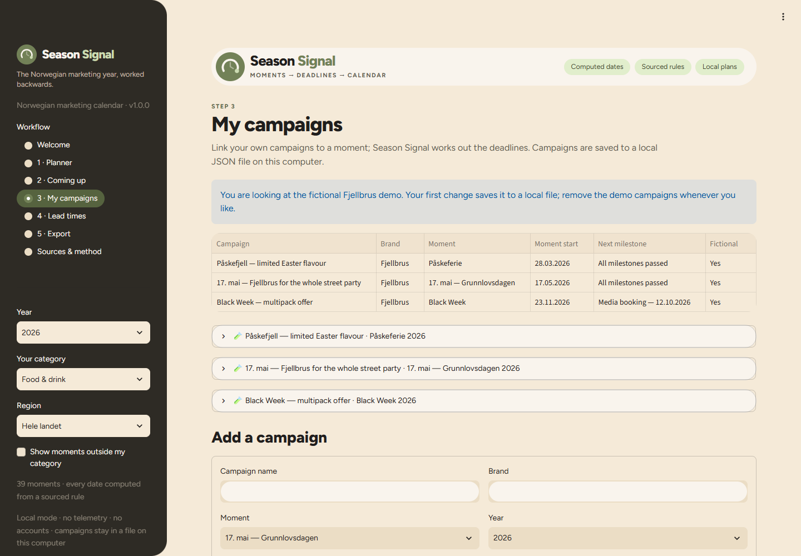
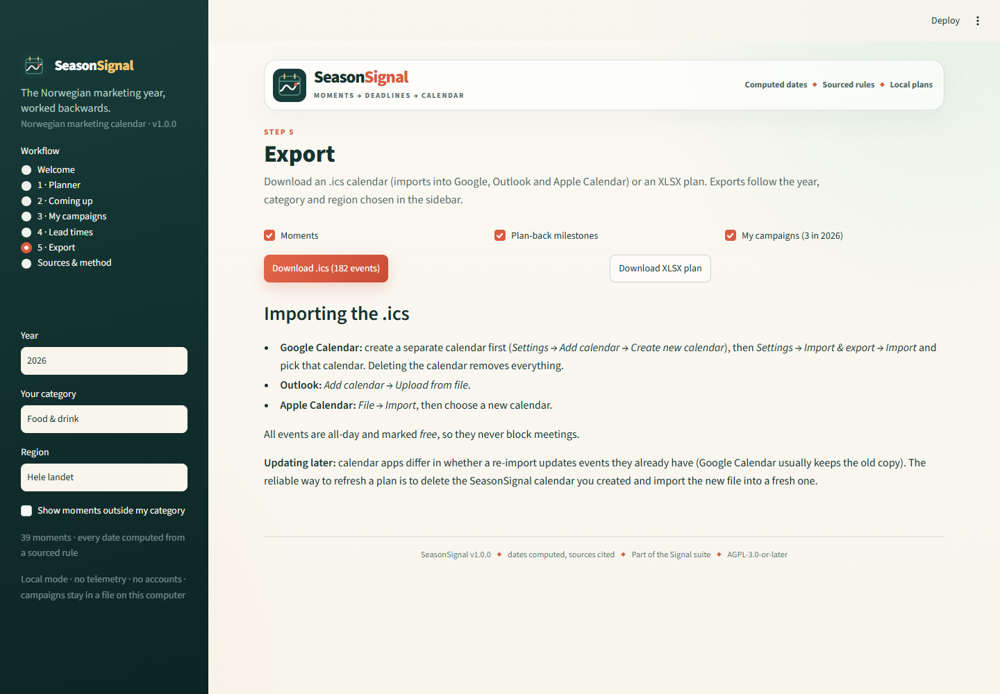

<p align="center">
  
</p>

<p align="center">
  
  
  <a href="LICENSE"></a>
</p>

<p align="center"><strong>An open Norwegian marketing calendar — the moments that matter, when to start, and an .ics for your calendar.</strong></p>

**SeasonSignal** lists the commercial moments of the Norwegian year, works backwards from each to planning deadlines, and exports everything to Google, Outlook or Apple Calendar. It replaces the spreadsheet (or paid planning add-on) that small Norwegian marketing teams keep re-typing every January. It asks:

> What are the Norwegian moments that matter for my category in the next 6–12 months, and when do I have to start each campaign to hit them?

Everything runs locally with open-source Python packages. There is no account, telemetry, scraping, external AI call, remote database or cloud upload.

## Read this first

- **Every date is computed from a rule** — Easter, "2nd Sunday of February", ISO week 28 — for any year from 2025 to 2035. Nothing is typed in per year.
- **Every rule is sourced or honestly labelled.** Holidays cite Lovdata; traditions such as morsdag and farsdag cite Store norske leksikon; Black Week, julebord and russetid are marked as *conventions* with a note explaining why.
- **School breaks vary by kommune**, so the national entry is a **range** (vinterferie = ISO week 8 *or* 9), never a guessed date. Regional rules for **Oslo, Bergen and Trondheim** reproduce each kommune's published skolerute and say which school years were checked (Oslo vinterferie is week 8, Bergen week 9 — exactly why a national date would be wrong).
- **Lead times are planning conventions**, not research. The defaults (e.g. food: concept −16 weeks, creative −10, media booking −6, live −1) are a starting point; edit them.
- Russetid is changing (vg3 exams are spread around 17. mai from 2026) and school routes change every year. Re-check before you commit budget.

<p align="center">
  
</p>

## Try the fictional demo in two minutes

1. Start the app. It opens on the current year, category **Food & drink** and region **Hele landet**.
2. Open **Planner** and click a bar or diamond — try *Black Week* or *17. mai* — to see concept, creative, media-booking and go-live dates.
3. Open **Coming up** for the next 6–12 months, across New Year: what is on track, what needs a late start (concept date passed, go-live still possible) and what has missed its go-live.
4. Open **My campaigns** to see **Fjellbrus**, a fictional alcohol-free drinks brand, with three campaigns: påske, 17. mai and Black Week.
5. Open **Export** and download the `.ics` file and the XLSX plan.

Fjellbrus is invented for this example and represents no real company.

| Planner | Coming up |
| --- | --- |
|  |  |
| **My campaigns** | **Export** |
|  |  |

No install? Import [`examples/seasonsignal-2026-moments.ics`](examples/seasonsignal-2026-moments.ics) (the 2026 Norwegian marketing year, 39 events) or the full [Fjellbrus demo calendar](examples/seasonsignal-2026-food-fjellbrus-demo.ics) with milestones straight into your calendar app.

## What's in the calendar

| Group | Moments |
| --- | --- |
| Public holidays (computed) | nyttårsdag, skjærtorsdag, langfredag, påskedag, 2. påskedag, 1. mai, 17. mai, Kristi himmelfartsdag, pinsedag, 2. pinsedag, 1. and 2. juledag |
| Retail | morsdag (2nd Sunday of **February**), Valentine's, Black Friday, Black Week (Monday → Cyber Monday), Cyber Monday, Singles' Day, Halloween, farsdag (2nd Sunday of **November**), julehandel, romjul/mellomjulssalg, feriepenger in June |
| Seasons | vinterferie, påskeferie, russetid, skoleslutt, fellesferie (ISO weeks 28–30), skolestart, høstferie, juleferie, julebord season |
| Cultural | Dry January, Samefolkets dag, fastelavn, sankthansaften, first Sunday of Advent, julaften, nyttårsaften |

Categories: Retail, Food & drink, Fashion, Travel, B2B, Alcohol-free, Kids & family. The full list with rules, bases and links is on the app's **Sources & method** page and in [`no.yaml`](src/seasonsignal/moments/no.yaml).

## Exports

- **`.ics`** (RFC 5545): all-day events, marked *free* so they never block meetings, with stable UIDs plus SEQUENCE/LAST-MODIFIED. Moments that vary locally are labelled "(varierer lokalt)" and carry the source link. In Google Calendar, create a separate calendar first, then *Settings → Import & export → Import* into it. Calendar apps differ in whether a re-import updates existing events (Google usually keeps the old copy), so to refresh a plan, delete that calendar and import the new file into a fresh one.
- **XLSX plan**: moments, milestones, campaigns, lead times and an About sheet. All cells are sanitised against spreadsheet formula injection.

## Run locally

You need Python 3.10 or newer and a local copy of this folder.

**macOS:** double-click `run_app.command`.

**Windows:** double-click `run_app.bat`.

The first launch creates a private `.venv` and installs the open-source dependencies; later launches reuse it. Or use a terminal:

```bash
python -m venv .venv
source .venv/bin/activate  # Windows: .venv\Scripts\activate
python -m pip install -r requirements.txt
python -m streamlit run app.py
```

Pages can be linked directly, e.g. `http://127.0.0.1:8587/?page=planner&moment=black_week` (pages: `planner`, `coming-up`, `campaigns`, `lead-times`, `export`, `sources`).

SeasonSignal uses local port `8587` (TrackSignal uses 8586). Set `SEASONSIGNAL_PORT` to choose another, `SEASONSIGNAL_DATA_DIR` to store campaigns elsewhere, or `SEASONSIGNAL_DEBUG=1` to reveal technical error details.

### Docker

```bash
docker build -t seasonsignal .
docker run --rm -p 8587:8587 seasonsignal
```

Then open `http://127.0.0.1:8587`. The container runs as a non-root user and includes a health check.

## Use it as a library

The package has no Streamlit dependency, so other Signal tools (or a future Signal Hub) can use it directly:

```bash
python -m pip install .          # core: moments, plan-back, .ics, XLSX
python -m pip install ".[app]"   # plus Streamlit and Plotly for the app
```

```python
from seasonsignal import DEFAULT_LEAD_TIMES, build_ics, load_library, moment_items, plan_moments

library = load_library()
week = library.resolve("black_week", 2027)               # 22.11.2027 – 29.11.2027
planned = plan_moments(library, [week], DEFAULT_LEAD_TIMES, "retail")
open("black-week-2027.ics", "wb").write(build_ics(moment_items(planned)))
```

## Privacy

Campaigns and lead times are saved to `data/seasonsignal.json` on your computer (git-ignored). Nothing is sent anywhere. Importing an `.ics` into a calendar provider shares its contents with that provider. See [PRIVACY.md](PRIVACY.md).

## Development checks

```bash
python -m pip install -e ".[test]"
python -m pytest
python -m ruff check .
python -m build
```

`scripts/generate_examples.py` rebuilds the files in `examples/` (a test fails if the committed calendars are stale) and `scripts/take_screenshots.py` recaptures the README screenshots from a running app (needs `pip install playwright` and Microsoft Edge).

The suite checks Easter-based holidays for several known years, morsdag and farsdag rules, Black Friday, Black Week and Advent, ISO-week ranges (including 53-week years), Oslo, Bergen and Trondheim's published school dates, the library contract (every moment sourced or explained), lead-time maths with weekend and holiday adjustment, local storage, `.ics` structure and validity, XLSX formula-injection safety, the rule that nothing under `src/` imports streamlit, and every Streamlit page for several years and regions.

## Relationship to the Signal suite

SeasonSignal is part of the [Signal suite](https://ulrikerlingsen.com/): local-first, explainable marketing tools with visible assumptions and auditable outputs. It shares the suite's look, fictional-demo rule and portable exports with tools such as **TrackSignal** (brand tracking). SeasonSignal tells you *when* to act; it does not forecast demand or measure campaign effects.

## Sources

Date rules are verified against [Lovdata](https://lovdata.no/) (helligdagsfredloven, the law on 1 and 17 May, ferieloven, opplæringslova), [Store norske leksikon](https://snl.no/), the skolerute of [Oslo](https://www.oslo.kommune.no/skole-og-utdanning/ferie-og-fridager/), [Bergen](https://www.bergen.kommune.no/omkommunen/avdelinger/etat-for-skole/ferie-og-fridager) and [Trondheim](https://www.trondheim.kommune.no/tema/skole/trondheimsskolen/overganger/ferie-og-fridager/), [Virke](https://www.virke.no/analyse/julehandel/) and [regjeringen.no](https://www.regjeringen.no/no/aktuelt/regjeringen-skal-endre-russetiden/id3030864/). Each moment's own link is in the library.

See [CONTRIBUTING.md](CONTRIBUTING.md), [SECURITY.md](SECURITY.md) and [CHANGELOG.md](CHANGELOG.md).

## License

The software and documentation are free under **AGPL-3.0-or-later**. See [LICENSE](LICENSE).

This application was developed with AI coding assistance and checked through source review, date fixtures for known years, automated app tests and visual inspection. Verify dates that matter to your budget against the linked sources; no warranty is provided.
