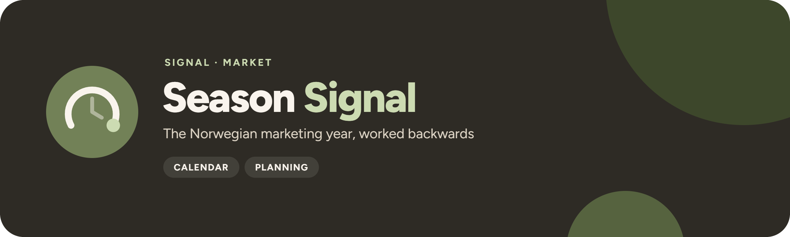

<p align="center">
  
</p>

<p align="center">
  <a href="https://github.com/UlrikErlingsen/marketing-calendar/actions"></a>
  <a href="https://github.com/UlrikErlingsen/signal-hub"></a>
  
  
  <a href="LICENSE"></a>
</p>

<p align="center"><strong>An open Norwegian marketing calendar — the moments that matter, when to start, and an .ics for your calendar.</strong></p>

**Season Signal** lists the commercial moments of the Norwegian year, works backwards from each to planning deadlines, and exports everything to Google, Outlook or Apple Calendar. It replaces the spreadsheet (or paid planning add-on) that small Norwegian marketing teams keep re-typing every January. It asks:

> What are the Norwegian moments that matter for my category in the next 6–12 months, and when do I have to start each campaign to hit them?

Everything runs locally with open-source Python packages. There is no account, telemetry, scraping, external AI call, remote database or cloud upload.

## Read this first

- **Every date is computed from a rule** — Easter, "2nd Sunday of February", ISO week 28 — for any year from 2025 to 2035. Nothing is typed in per year.
- **Every rule is sourced or honestly labelled.** Holidays cite Lovdata; traditions such as morsdag and farsdag cite Store norske leksikon; Black Week, julebord and russetid are marked as *conventions* with a note explaining why.
- **School breaks vary by kommune**, so the national entry is a **range** (vinterferie = ISO week 8 *or* 9), never a guessed date. Regional rules for **Oslo, Bergen and Trondheim** reproduce each kommune's published skolerute and say which school years were checked (Oslo vinterferie is week 8, Bergen week 9 — exactly why a national date would be wrong).
- **Lead times are planning conventions**, not research. The defaults (e.g. food: concept −16 weeks, creative −10, media booking −6, live −1) are a starting point; edit them.
- Russetid is changing (vg3 exams are spread around 17. mai from 2026) and school routes change every year. Re-check before you commit budget.

<p align="center">
  
</p>

## Scope

**Version 1.0 supports:**

- 39 Norwegian moments, computed for any year from 2025 to 2035:

  | Group | Moments |
  | --- | --- |
  | Public holidays (computed) | nyttårsdag, skjærtorsdag, langfredag, påskedag, 2. påskedag, 1. mai, 17. mai, Kristi himmelfartsdag, pinsedag, 2. pinsedag, 1. and 2. juledag |
  | Retail | morsdag (2nd Sunday of **February**), Valentine's, Black Friday, Black Week (Monday → Cyber Monday), Cyber Monday, Singles' Day, Halloween, farsdag (2nd Sunday of **November**), julehandel, romjul/mellomjulssalg, feriepenger in June |
  | Seasons | vinterferie, påskeferie, russetid, skoleslutt, fellesferie (ISO weeks 28–30), skolestart, høstferie, juleferie, julebord season |
  | Cultural | Dry January, Samefolkets dag, fastelavn, sankthansaften, first Sunday of Advent, julaften, nyttårsaften |

- Categories: Retail, Food & drink, Fashion, Travel, B2B, Alcohol-free, Kids & family. Regions: Hele landet, Oslo, Bergen and Trondheim kommune.
- A 12-month planner, a "coming up" view across New Year, your own campaigns linked to a moment, editable lead times, and `.ics` and XLSX exports.

The full list with rules, bases and links is on the app's **Sources & method** page and in [`no.yaml`](src/seasonsignal/moments/no.yaml).

**It does not:** create accounts, sync, send reminders, scrape, forecast demand or measure campaign effects. Season Signal tells you *when* to act.

## Try the demo in two minutes

1. Start the app. It opens on the current year, category **Food & drink** and region **Hele landet**.
2. Open **Planner** and click a bar or diamond — try *Black Week* or *17. mai* — to see concept, creative, media-booking and go-live dates.
3. Open **Coming up** for the next 6–12 months, across New Year: what is on track, what needs a late start (concept date passed, go-live still possible) and what has missed its go-live.
4. Open **My campaigns** to see **Fjellbrus**, a fictional alcohol-free drinks brand, with three campaigns: påske, 17. mai and Black Week.
5. Open **Export** and download the `.ics` file and the XLSX plan.

Fjellbrus is invented for this example and represents no real company.

| Planner | Coming up |
| --- | --- |
|  |  |
| **My campaigns** | **Export** |
|  |  |

## Data contract

Season Signal has two inputs, both plain files:

- **The moments library**, [`src/seasonsignal/moments/no.yaml`](src/seasonsignal/moments/no.yaml), ships with the app. Each moment has an id, a name in Norwegian and English, a kind, a date rule (one day, or a start and end for an inclusive range), category tags, a basis, a source URL and notes. Moments set by kommune or fylke carry `varies` and a national range; regional `variants` add a verified rule per region with the school years that were checked.
- **Your saved plans**, `data/seasonsignal.json` (or the folder in `SEASONSIGNAL_DATA_DIR`), hold your campaigns and lead times. A file from another version, or one with a malformed campaign, is reported with its path instead of being overwritten; an older file missing a milestone gets the default for that milestone.

| Basis | Meaning | Example |
|---|---|---|
| official | set by law or by the owning body | 17. mai, Kristi himmelfartsdag (Lovdata) |
| tradition | a long-established date rule documented by an authoritative reference | morsdag, farsdag (SNL) |
| observed | set locally; national range plus verified regional rules | vinterferie, høstferie |
| convention | a commercial or cultural habit without an owner; the note says why | Black Week, julebord, russetid |

See [CONTRIBUTING.md](CONTRIBUTING.md) for how to add or change a moment.

## Methods

1. **Date rules.** Every date comes from a rule: `fixed`, `easter`, `nth_weekday`, `weekday_on_or_after`, `iso_week` or `relative`, each with an optional day offset. Easter follows the Western (Gregorian) computus (`dateutil.easter`), matching helligdagsfredloven. Week numbers are ISO 8601, as used in Norway, including 53-week years.
2. **Region.** For a region with a verified rule the regional date replaces the national range; otherwise the national range is shown and labelled "varies locally".
3. **Lead times.** Each category has default offsets in whole weeks for concept & brief, creative, media booking and campaign live (0–52 weeks, concept ≥ creative ≥ media ≥ live). They are editable and saved locally.
4. **Plan-back.** Milestones are whole weeks before a moment's first day — for ranges that vary by kommune, the earliest local start — and move back to the previous working day when they land on a weekend or public holiday.

The library was last reviewed on 1 October 2026.

## Planning statuses

Each moment is graded for a team starting today:

- **ON TRACK**: the concept deadline is more than two weeks away.
- **START SOON**: the concept deadline is within 14 days.
- **LATE START**: the concept deadline has passed, but go-live is still ahead — plan a compressed timeline.
- **MISSED GO-LIVE**: the go-live date has passed but the moment has not started; only a reactive presence is realistic.
- **HAPPENING NOW**: the moment is under way.
- **PASSED**: the moment is over.

Single milestones are **on track**, **due soon** (within 14 days) or **overdue**.

## Exports

- **`.ics`** (RFC 5545): all-day events, marked *free* so they never block meetings, with stable UIDs plus SEQUENCE/LAST-MODIFIED. Moments that vary locally are labelled "(varierer lokalt)" and carry the source link. In Google Calendar, create a separate calendar first, then *Settings → Import & export → Import* into it. Calendar apps differ in whether a re-import updates existing events (Google usually keeps the old copy), so to refresh a plan, delete that calendar and import the new file into a fresh one.
- **XLSX plan**: moments, milestones, campaigns, lead times and an About sheet. All cells are sanitised against spreadsheet formula injection.

Exports follow the year, category and region chosen in the sidebar.

## Run locally

You need Python 3.10 or newer and a local copy of this folder.

**macOS:** double-click `run_app.command`. **Windows:** double-click `run_app.bat`.

The first launch creates a private `.venv` and installs the open-source dependencies; later launches reuse it. Or use a terminal:

```bash
python -m venv .venv
source .venv/bin/activate  # Windows: .venv\Scripts\activate
python -m pip install -r requirements.txt
python -m streamlit run app.py
```

Pages can be linked directly, e.g. `http://127.0.0.1:8587/?page=planner&moment=black_week` (pages: `planner`, `coming-up`, `campaigns`, `lead-times`, `export`, `sources`).

Season Signal uses local port `8587` (Track Signal uses 8586). Set `SEASONSIGNAL_PORT` to choose another, `SEASONSIGNAL_DATA_DIR` to store campaigns elsewhere, or `SEASONSIGNAL_DEBUG=1` to reveal technical error details.

### Docker

```bash
docker build -t seasonsignal .
docker run --rm -p 8587:8587 seasonsignal
```

Then open `http://127.0.0.1:8587`. The container runs as a non-root user and includes a health check.

### Inside Signal Hub

[Signal Hub](https://github.com/UlrikErlingsen/signal-hub) embeds Season Signal through `seasonsignal.ui.render()`. With `SIGNAL_HUB=1`, campaigns and lead times live in your browser session only, starting from the fictional Fjellbrus demo; no save file is read or written on the server, `?page=` deep links are off (the Hub owns the URL), and the `.ics` and XLSX exports are in-memory downloads as always. To keep campaigns between visits, export them or run Season Signal locally.

### Use it as a library

The core package has no Streamlit dependency, so other Signal tools (or Signal Hub) can use it directly:

```bash
python -m pip install .          # core: moments, plan-back, .ics, XLSX
python -m pip install ".[ui]"    # plus Streamlit and Plotly for the app
```

```python
from seasonsignal import DEFAULT_LEAD_TIMES, build_ics, load_library, moment_items, plan_moments

library = load_library()
week = library.resolve("black_week", 2027)               # 22.11.2027 – 29.11.2027
planned = plan_moments(library, [week], DEFAULT_LEAD_TIMES, "retail")
open("black-week-2027.ics", "wb").write(build_ics(moment_items(planned)))
```

## Privacy

Campaigns and lead times are saved to `data/seasonsignal.json` on your computer (git-ignored). Nothing is sent anywhere. Inside Signal Hub nothing is saved at all: plans last for your browser session. Importing an `.ics` into a calendar provider shares its contents with that provider. See [PRIVACY.md](PRIVACY.md).

## No install? Import the example calendars

Import [`examples/seasonsignal-2026-moments.ics`](examples/seasonsignal-2026-moments.ics) (the 2026 Norwegian marketing year, 39 events) or the full [Fjellbrus demo calendar](examples/seasonsignal-2026-food-fjellbrus-demo.ics) with milestones straight into your calendar app. The [XLSX plan](examples/seasonsignal-2026-food-fjellbrus-demo.xlsx) shows the same demo as a spreadsheet.

## Development

```bash
python -m pip install -e ".[test]"
python -m pytest
python -m ruff check .
python -m build
```

`scripts/generate_examples.py` rebuilds the files in `examples/` (a test fails if the committed calendars are stale) and `scripts/take_screenshots.py` recaptures the README screenshots from a running app (needs `pip install playwright` and Microsoft Edge).

The suite checks Easter-based holidays for several known years, morsdag and farsdag rules, Black Friday, Black Week and Advent, ISO-week ranges (including 53-week years), Oslo, Bergen and Trondheim's published school dates, the library contract (every moment sourced or explained), lead-time maths with weekend and holiday adjustment, local storage, `.ics` structure and validity, XLSX formula-injection safety, the rule that nothing under `src/` imports streamlit except `seasonsignal.ui`, the shared Signal look, every Streamlit page for several years and regions, and the Signal Hub contract: `render()` without page config, slug-namespaced keys, a render from the packaged files alone, and Hub mode with session-only plans, no files written or read and no network calls.

See [CONTRIBUTING.md](CONTRIBUTING.md), [SECURITY.md](SECURITY.md), [CHANGELOG.md](CHANGELOG.md) and [CITATION.cff](CITATION.cff).

## Where this fits in Signal

Season Signal is part of the Market family: it tells a team *when* to act in the Norwegian year. **Prospect Signal** finds the market, **Listen Signal** hears what media and social channels say, and **Influence Signal** checks creator campaigns; Season Signal works out when each campaign has to start. It shares the suite's look, fictional-demo rule and portable exports.

<!-- signal-suite:start (generated from signal-hub/apps.yaml by scripts/sync_readme_suite.py) -->
| Family | App | Asks |
|---|---|---|
| Brand | [Track Signal](https://github.com/UlrikErlingsen/brand-tracking) | Is the brand moving, or is the tracker just noisy? |
| Brand | [Position Signal](https://github.com/UlrikErlingsen/brand-positioning) | Where do brands sit relative to competitors? |
| Market | [Prospect Signal](https://github.com/UlrikErlingsen/b2b-prospecting) | Which Norwegian companies fit your ideal customer, and which first? |
| Market | [Listen Signal](https://github.com/UlrikErlingsen/media-listening) | Who is talking about the brand in Norwegian media, and in what tone? |
| Market | [Influence Signal](https://github.com/UlrikErlingsen/influencer-campaigns) | Which creators delivered, and was every post labelled properly? |
| Market | **Season Signal** (this app) | What does the Norwegian marketing year look like, worked backwards? |
| Market | [Adopt Signal](https://github.com/UlrikErlingsen/adoption-forecasting) | When will a new product be adopted? |
| Market | [Rival Signal](https://github.com/UlrikErlingsen/competitor-analysis) | Which rivals matter, and how could they respond? |
| Market | [Reach Signal](https://github.com/UlrikErlingsen/location-catchment-analysis) | Where could a new location reach, and how would it share demand with existing sites? |
| Customer | [Worth Signal](https://github.com/UlrikErlingsen/customer-value-analytics) | What are customers and relationships worth? |
| Customer | [Segment Signal](https://github.com/UlrikErlingsen/customer-segmentation) | Do customers form stable, useful groups? |
| Customer | [Trace Signal](https://github.com/UlrikErlingsen/journey-path-analysis) | How do logged customer journeys actually unfold? |
| Customer | [Blueprint Signal](https://github.com/UlrikErlingsen/service-blueprinting) | How is the customer experience actually delivered, and where do the handoffs fail? |
| Customer | [Recommend Signal](https://github.com/UlrikErlingsen/recommender-evaluation) | Which recommendation policy should be tested live? |
| Research | [Choice Signal](https://github.com/UlrikErlingsen/conjoint-analysis) | How do product attributes drive choice? |
| Research | [Driver Signal](https://github.com/UlrikErlingsen/survey-driver-analysis) | Which measured experiences move with satisfaction? |
| Research | [Measure Signal](https://github.com/UlrikErlingsen/measurement-validation) | Does a multi-item score have a defensible structure? |
| Research | [Text Signal](https://github.com/UlrikErlingsen/open-text-analysis) | What recurring patterns appear in open-ended responses? |
| Research | [Tag Signal](https://github.com/UlrikErlingsen/pricing-analysis) | What price range is supported, and how does profit move? |
| Research | [Learn Signal](https://github.com/UlrikErlingsen/research-prioritization) | Which uncertainty is worth paying to research before you decide? |
| Decide | [Experiment Signal](https://github.com/UlrikErlingsen/experiment-analysis) | Did the treatment cause a practically meaningful change? |
| Decide | [Gate Signal](https://github.com/UlrikErlingsen/launch-decision-gate) | Does a concept deserve the next investment? |
| Decide | [Shift Signal](https://github.com/UlrikErlingsen/cannibalization-analysis) | Does a launch grow the portfolio, or move existing demand around? |
| Decide | [Alloc Signal](https://github.com/UlrikErlingsen/marketing-mix-allocation) | Where should the next marketing budget go? |

All 24 apps run side by side in [Signal Hub](https://github.com/UlrikErlingsen/signal-hub), each opening with fictional demo data. Every repo carries the [`signal-suite`](https://github.com/topics/signal-suite) topic, and the suite is listed at [ulrikerlingsen.com](https://ulrikerlingsen.com). Freddo CRM is a separate product.
<!-- signal-suite:end -->

## References

Date rules are verified against these sources; each moment's own link is in the library.

- [Lovdata](https://lovdata.no/): helligdagsfredloven, the law on 1 and 17 May, ferieloven, opplæringslova.
- [Store norske leksikon](https://snl.no/): traditions such as morsdag, farsdag, advent, fastelavn and sankthans.
- Skolerute of [Oslo](https://www.oslo.kommune.no/skole-og-utdanning/ferie-og-fridager/), [Bergen](https://www.bergen.kommune.no/omkommunen/avdelinger/etat-for-skole/ferie-og-fridager) and [Trondheim](https://www.trondheim.kommune.no/tema/skole/trondheimsskolen/overganger/ferie-og-fridager/) kommune.
- [Virke](https://www.virke.no/analyse/julehandel/): julehandel.
- [regjeringen.no](https://www.regjeringen.no/no/aktuelt/regjeringen-skal-endre-russetiden/id3030864/): the change to russetid.

## Originality and license

Season Signal is an independent implementation built from public sources (Norwegian law, reference works and kommune school calendars, listed above) and original fictional examples.

The software and documentation are free under **AGPL-3.0-or-later**. See [LICENSE](LICENSE).

This application was developed with AI coding assistance and checked through source review, date fixtures for known years, automated app tests and visual inspection. Verify dates that matter to your budget against the linked sources; no warranty is provided.

---

<p>
  
  <strong>Season Signal</strong> is part of <a href="https://github.com/UlrikErlingsen/signal-hub"><strong>Signal</strong></a>, open marketing-evidence tools by <a href="https://ulrikerlingsen.com">Ulrik Erlingsen</a>.
</p>
